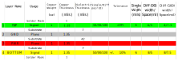

# Turpial Hardware

Source files for Turpial hardware, designed using KiCAD v5.

## License

Copyright (C) 2021 Locha Mesh Developers

Licensed under the OHL-W-v2 Open Hardware license.

See [LICENSE](./LICENSE) for more information.

## The PCB Stack

According to the recomendations of Texas Instruments the stack will be a 4 layers sandwitch containing:

### Layers, view and dimensions

### Vias, view and dimensions

## Plugins and Tools

### Required

#### RF Tools _KICAD PLUGIN_
    URL: https://github.com/easyw/RF-tools-KiCAD

####  Teardrops
    URL: https://github.com/NilujePerchut/kicad_scripts

### Optionals

#### INTERACTIVE BOM _KICAD PLUGIN_
    Description: Generate an interactive html Bill Of Materials (BOM)
    URL: https://github.com/openscopeproject/InteractiveHtmlBom
    
#### GRAPHICAL SYMBOL GENERATOR (KiSymGen) _KICAD PLUGIN_
    Description: KiSymGen is a graphical symbol generator which makes this process visual and less painful.
    URL: https://github.com/pixellon/imgui
    
#### library.io _ONLINE_TOOL_
    Description: Instantly generate PCB packages by entering a few dimensions from a data sheet.
    URL: https://library.io/
  

